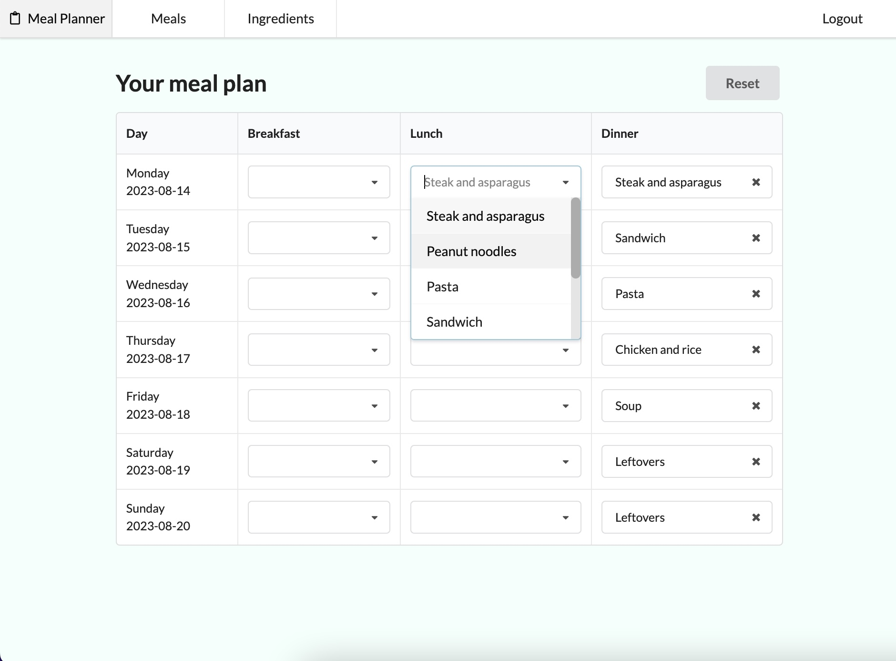
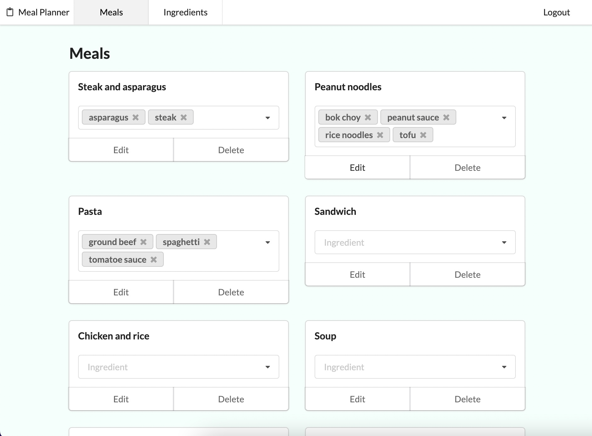
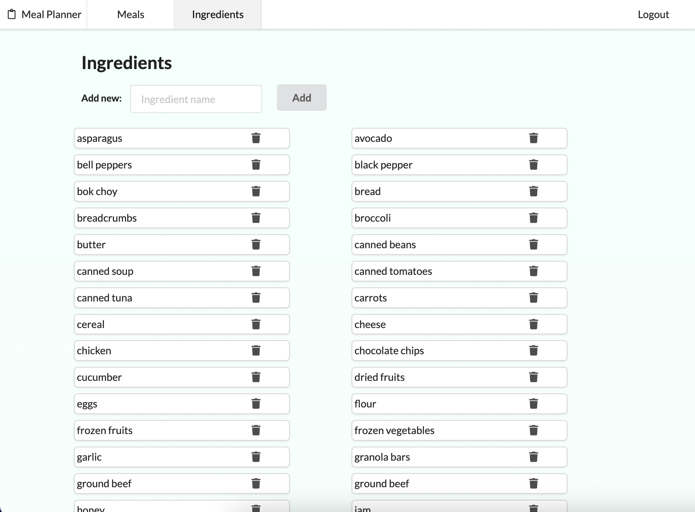

# Phase 4 Project: Meal Planner

## Overview

This phase 4 project is a meal planner that lets users pick meals for the upcoming week.

## Build and deployment

Build command:

```shell
pip install -r requirements.txt && npm install --prefix client && npm run build --prefix client
```

Env variables:

- DATABASE_URI

## User Stories

*MVP:*

[signup/login page]

- ✅ Log in
- ✅ Sign up page

[Navbar]

- ✅ Switch between Home, Meals, ingredients
- ✅ Log out

[Home page]

- ✅ View my meal plan with list of meals for the week (shows most recent meal plan)
- ✅ Reset my meal calendar (remove all meals)
- ✅ Add meal to weekly calendar by clicking from list
- ✅ Remove meal from weekly calendar

[manage meals page]

- ✅ Meal belongs to user_id
- ✅ View all meals
- ✅ Add meal
- ✅ Add ingredient to meal from ingredient list
- ✅ Edit meal title
- ✅ Edit meal ingredients
- ✅Delete meal

[manage ingredients page]

- ✅ Ingredient belongs to user_id
- ✅ View all ingredients
- ✅ Add new ingredient
- ✅ Delete ingredient

*Stretch:*

- Add loaders (for slower production build on render.com)
- Add new ingredient directly from add meal form
- Highlight today in the meal plan
- Navigate forward and backward in time for meal plans
- Get grocery list of ingredients needed for all meals that week
- Auto generate meal plan with random set of meals
- Let user create inventory of ingredients they already have
- User can adjust shopping list by subtracting inventory from gorcery list
- User can filter meal options to add to meal plan based on inventory

## Database structure

[dbdiagram.io](https://dbdiagram.io/d)

Table users {
  id Integer [primary key]
  username String
  passwordhash String
}

Table meal_plans {
  id Integer [primary key]
  user_id Integer
  created_at Timestamp
  updated_at Timestamp
  meals Relationship
}

Table meals{
  id Integer [primary key]
  user_id Integer
  name String
  ingredients Relationship
  cook_time_mins Integer
}

Table ingredients{
  id Integer [primary key]
  user_id Integer
  name String
  category String
}

Ref: users.id - meal_plans.user_id
Ref: meals.user_id - users.id
Ref: ingredients.user_id - users.id
Ref: meal_plans.id <> meals.id
Ref: meals.id <> ingredients.id

## Screenshots of the app





## Requirements [link](https://github.com/learn-co-curriculum/python-p4-phase-4-project)

| requirement | status | notes |
|---|---|---|
| Use a Flask API backend with a React frontend. | `Done` | See client and server dirs |
| Have at least three models on the backend, that include the following: | `Done` | User, Ingredient, Meal, MealPlan|
| At least two one-to-many relationships. | `Done` | (1) User (one) to MealPlan (many), User (one) to Ingredient (many) |
| At least one reciprocal many-to-many relationship. | `Done` | Meal to Ingredient |
| Full CRUD actions for at least one resource. | `Done` | Ingredients(Resource) has all CRUD. Meal model has get, post, patch, delete. But spread across Meals(Resource) and class MealById(Resource) |
| Minimum of create and read actions for EACH resource. | `Done` | All have at least create and read |
| Use forms and validation through Formik on all input. | `Done` | All forms use Formik (except those using dropdown input) |
| At least one data type validation. | `Done` | Cook time for meals time: yup.number().typeError('must be number').positive().integer('must be an integer').notRequired()
 |
| At least one string/number format validation. | `Done` | Have multiple string validations |
| Have at least three different client-side routes using React Router. Be sure to include a nav bar or other UI element that allows users to navigate between routes. | `Done` | Have '/', '/meals' and '/ingredients' |
| Connect the client and server using fetch(). | `Done` | Numerous fetch() requests |
