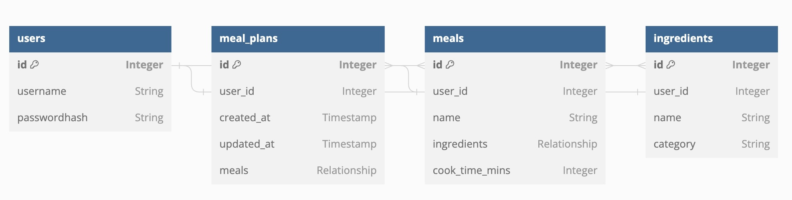

# Phase 4 Project: Meal Planner

## Overview

This phase 4 project is a meal planner that lets users pick meals for the upcoming week.

## User Stories

*MVP:*

[signup/login page]

- ✅ Log in

[Navbar]

- ✅ Switch between Home, Meals, ingredients
- ✅ Log out

[Home page]

- ✅ View my meal plan with list of meals for the week (shows most recent meal plan)
- ✅ Reset my meal calendar (remove all meals)
- ✅ Add meal to weekly calendar by clicking from list
- ✅ Remove meal from weekly calendar

[manage meals page]

- ✅ Meal belongs to user_id
- ✅ View all meals
- ✅ Add meal
- ✅ Add ingredient to meal from ingredient list
- ✅ Edit meal title
- ✅ Edit meal ingredients
- ✅Delete meal

[manage ingredients page]

- ✅ Ingredient belongs to user_id
- ✅ View all ingredients
- ✅ Add new ingredient
- ✅ Delete ingredient

*Stretch:*

- Sign up page
- Add new ingredient directly from add meal form
- Navigate forward and backward in time for meal plans
- Get grocery list of ingredients needed for all meals that week
- Auto generate meal plan with random set of meals
- Let user create inventory of ingredients they already have
- User can adjust shopping list by subtracting inventory from gorcery list
- User can filter meal options to add to meal plan based on inventory

## Database structure

[dbdiagram.io](https://dbdiagram.io/d)

Table users {
  id Integer [primary key]
  username String
  passwordhash String
}

Table meal_plans {
  id Integer [primary key]
  user_id Integer
  created_at Timestamp
  updated_at Timestamp
  meals Relationship
}

Table meals{
  id Integer [primary key]
  user_id Integer
  name String
  ingredients Relationship
  cook_time_mins Integer
}

Table ingredients{
  id Integer [primary key]
  user_id Integer
  name String
  category String
}

Ref: users.id - meal_plans.user_id
Ref: meals.user_id - users.id
Ref: ingredients.user_id - users.id
Ref: meal_plans.id <> meals.id
Ref: meals.id <> ingredients.id
